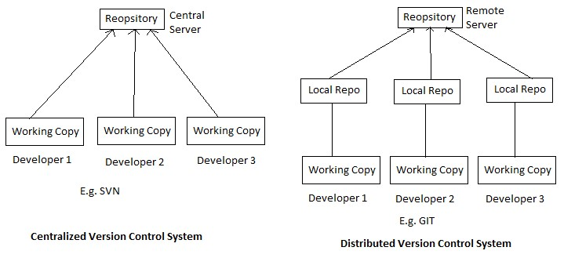
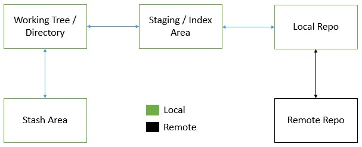

VCS (Version Control System)
----------------------------
* This is a software which helps organizations to maintain source code.
* Helps in maintaining history of changes.
* Allows us to maintain track of different releases given to customers.
* It allows parlell development by multiple developers.

### Generations or Types of VCS
#### Local VCS: 
   * simplest form of version control system, and it operates on a single computer without the need for a central server. In an LVCS, changes to files are tracked and managed within the local file system itself, typically through the use of file copies or directories.
   * Scalability is not possible.
#### Centralized VCS:
   * A central server will store the entire history of the project.
   * Developers check out files from this central repository to work on them locally. Once they've made changes, they commit those changes back to the central server.
   * CVCS systems typically have a client-server architecture, where developers interact with the central server over a network connection.
   * Ex: Concurrent Versions System (CVS) and Apache Subversion (SVN).
#### Distributed VCS:
   * In a DVCS, every developer has their own local copy of the entire repository, including its history.
   * Developers can commit changes to their local repository without needing to be connected to a central server. They can also work offline and independently.
   * Changes can be shared between repositories by pushing and pulling changes between them.
   * DVCS systems enable more flexible workflows, branching and merging, and better support for distributed teams.
   * Ex: Git

### GIT

* GIT is a distributed version control system
#### Areas of GIT
   * Working Directory / Tree 
   * Statging / Index Area
   * Local Repository
   * Remote Repository
   * Stash Area
#### GIT workflow

#### Creating local repo
   * To create a local repo we need to have git installed in the system.
   * Then initialise a git local repository with `git init`.
   * This will create a `.git` folder in `pwd`.
##### Working Directory:
   * The working directory is the area on your local machine where you edit, modify, and create files. It represents the current state of your project's files.
##### Staging / Index Area:
   * The staging area, also known as the index, is an intermediate area where changes to files are prepared before they are committed to the repository.
   * Files in the staging area are ready to be included in the next commit, but they have not yet been permanently recorded in the repository.
##### Local Repository:
   * The local repository is the Git database on your local machine where all the project's history, branches, and commits are stored.
   * When you commit changes, Git records them in the local repository, creating a new commit object that represents the current state of the project.
##### Remote Repository:
   * The remote repository is a Git repository hosted on a remote server, such as GitHub, GitLab, or Bitbucket.
   * Developers can push changes from their local repository to the remote repository to share their work with others, collaborate on projects, and synchronize changes between multiple contributors.